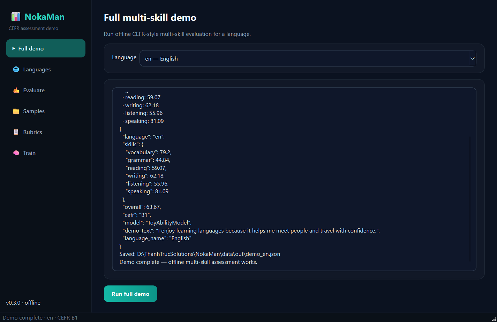
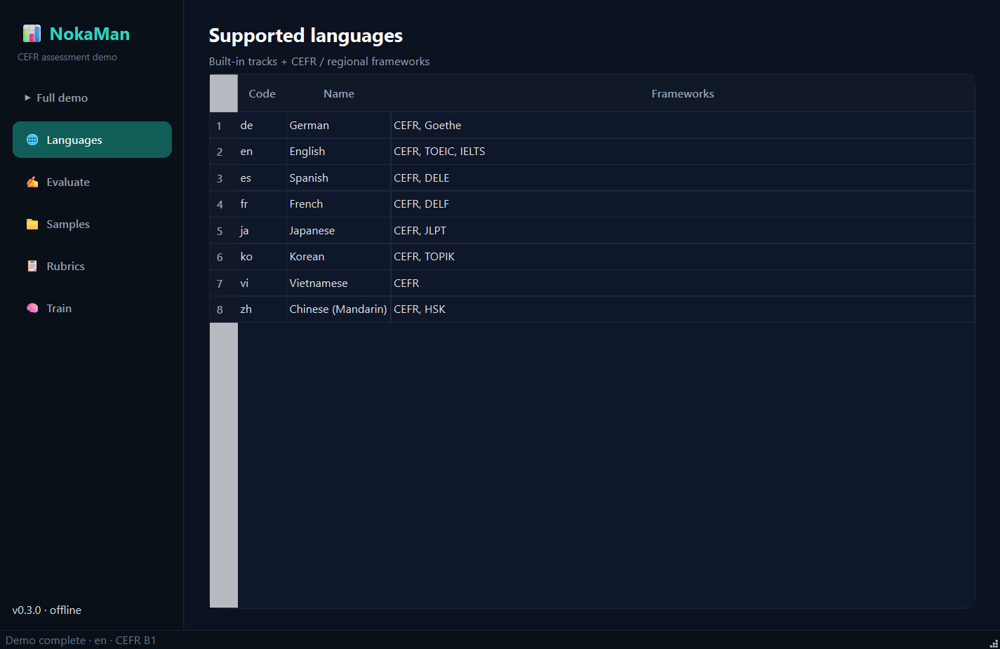
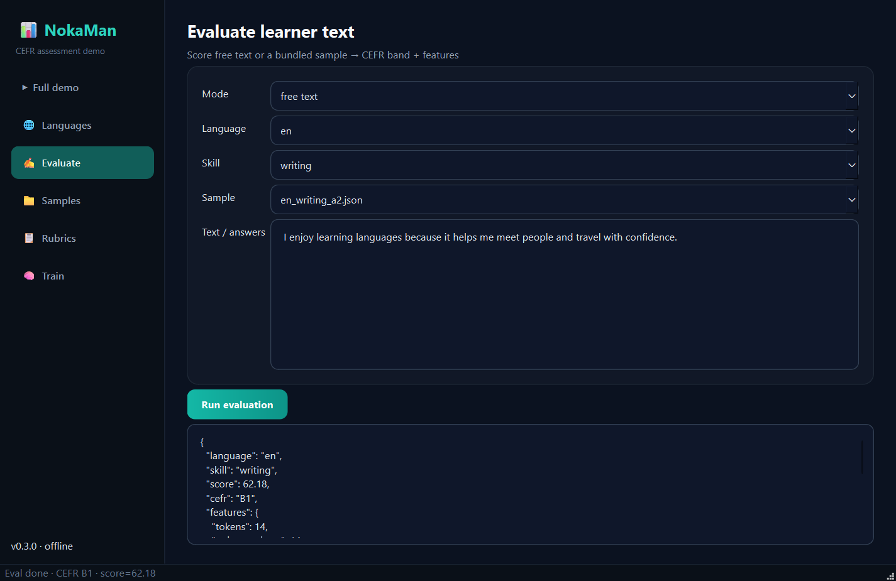
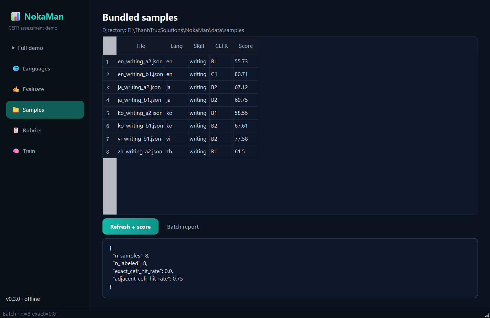
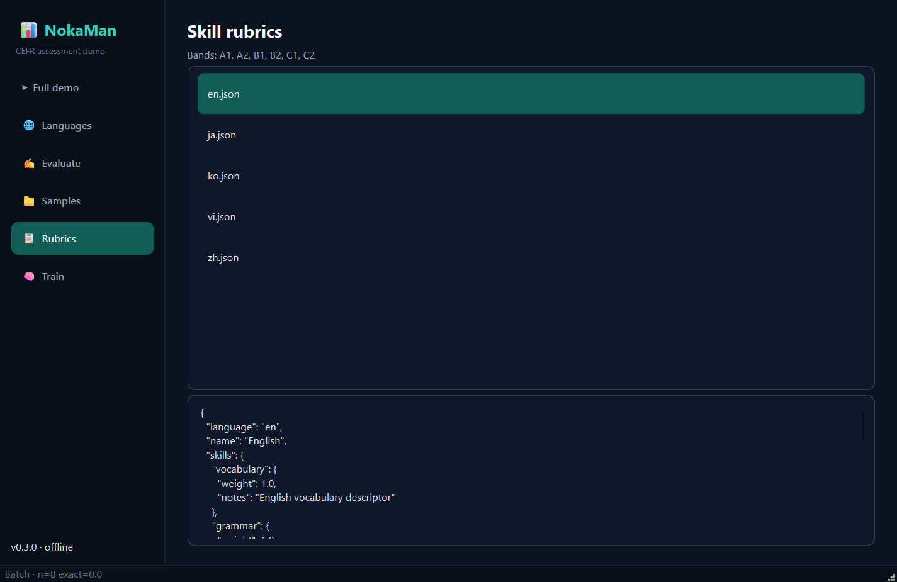
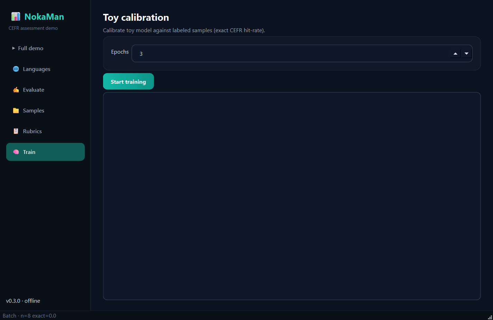
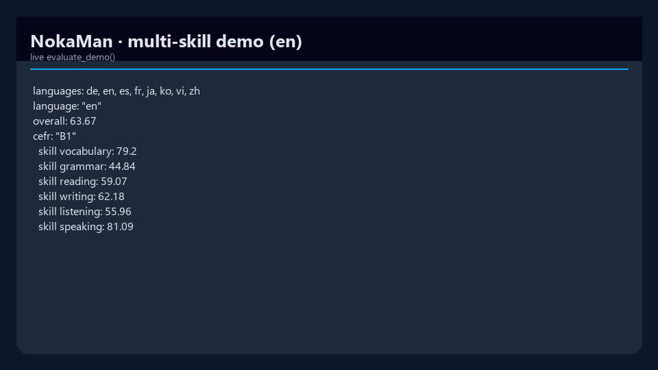
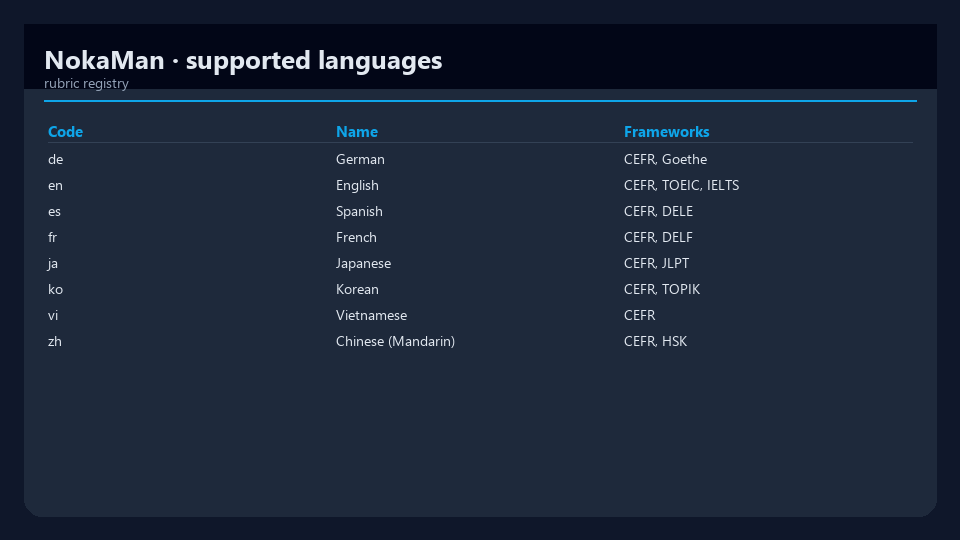

# NokaMan

[](https://www.python.org/downloads/)
[](pyproject.toml)
[](src/nokaman/gui/)
[](LICENSE)
[](https://github.com/mergeos-bounties)

**NokaMan** assesses **language-learning ability** across multiple skills and languages — CEFR-style bands, rubrics, and JSON reports ready for learning apps.

**Product:** [mergeos-bounties/NokaMan](https://github.com/mergeos-bounties/NokaMan)

---

## Table of contents

- [Highlights](#highlights)
- [Desktop GUI (Qt)](#desktop-gui-qt)
- [Screenshots](#screenshots)
- [Quick start](#quick-start)
- [CLI reference](#cli-reference)
- [Languages & rubrics](#languages--rubrics)
- [Diagrams](#diagrams)
- [Repository layout](#repository-layout)
- [Development](#development)
- [MergeOS bounties](#mergeos-bounties)
- [License](#license)

---

## Highlights

| Mode | Description |
| --- | --- |
| **Multi-skill eval** | Vocabulary, grammar, reading, writing, listening, speaking proxies |
| **CEFR-style bands** | Map scores → A1–C2 style levels (scaffold) |
| **Multi-language** | EN, KO, JA, VI, ZH (+ extend via rubrics) |
| **JSON reports** | Save under `OUT_DIR` for app integration |
| **Offline demo** | `nokaman demo --lang en` end-to-end |
| **Desktop GUI** | Modern **PySide6** app (`nokaman-gui`) |

---

## Desktop GUI (Qt)

Modern dark **PySide6** demo — multi-skill evaluation, languages, free-text scoring, samples, rubrics, toy calibration.

```powershell
pip install -e ".[gui]"
nokaman-gui
# or: nokaman gui
```

<p align="center">
  
</p>
<p align="center"><em>Full multi-skill demo</em></p>

<p align="center">
  
</p>
<p align="center"><em>Supported languages & frameworks</em></p>

<p align="center">
  
</p>
<p align="center"><em>Evaluate free text / samples / placement</em></p>

<p align="center">
  
</p>
<p align="center"><em>Bundled samples + batch metrics</em></p>

<p align="center">
  
</p>
<p align="center"><em>Skill rubrics</em></p>

<p align="center">
  
</p>
<p align="center"><em>Toy calibration</em></p>

---

## Screenshots

CLI / terminal captures:

| Evaluation demo | Languages |
| :---: | :---: |
|  |  |
| *English multi-skill demo* | *Supported languages registry* |

---

## Quick start

```powershell
cd NokaMan
python -m venv .venv
.\.venv\Scripts\activate
pip install -e ".[dev,gui]"

nokaman version
nokaman languages list
nokaman demo --lang en
nokaman rubrics list
nokaman-gui
```

---

## CLI reference

| Command | Purpose |
| --- | --- |
| `nokaman version` | Version + language codes |
| `nokaman demo -l en` | Full multi-skill evaluation demo |
| `nokaman languages list` | Supported languages + frameworks |
| `nokaman rubrics list [-l en]` | Skill rubrics |
| `nokaman eval text …` | Evaluate free text |
| `nokaman train …` | Toy calibration |
| `nokaman gui` / `nokaman-gui` | **Qt desktop app** (needs `.[gui]`) |
| `nokaman serve` | Optional FastAPI |

```powershell
nokaman demo -l vi
nokaman demo -l ko
nokaman-gui
```

---

## Languages & rubrics

Rubrics and samples live under `data/`. Extend by adding rubric JSON + samples, then register in `nokaman.rubrics.registry`.

| Code | Typical use |
| --- | --- |
| `en` | English (default demo) |
| `vi` | Vietnamese |
| `ko` / `ja` / `zh` | East Asian tracks |

---

## Diagrams

System architecture and workflow — full width. Open the HTML files for **dark/light theme** and export (PNG/SVG).

### Architecture

[Open interactive diagram](docs/diagrams/architecture.html)

<p align="center">
  
</p>

### Workflow

[Open interactive diagram](docs/diagrams/workflow.html)

<p align="center">
  
</p>

*Generated with [archify](https://github.com/tt-a1i).*

---

## Repository layout

```text
src/nokaman/
  cli.py
  gui/            # PySide6 desktop demo (nokaman-gui)
  eval/           # pipeline, metrics, placement
  rubrics/        # language metadata + skills
  data/loader.py
  train/toy_train.py
docs/screenshots/
docs/diagrams/
```

---

## Development

```powershell
pytest -q
ruff check src tests
nokaman demo -l en
python scripts/capture_gui_shots.py   # refresh GUI screenshots
```

---

## MergeOS bounties

Star + claim bounty → PR to **master** with demo JSON / screenshots → MRG **25–200**.  
See org policy on [mergeos](https://github.com/mergeos-bounties/mergeos).

---

## Tiếng Việt

**NokaMan** đánh giá năng lực học ngôn ngữ đa kỹ năng (EN/VI/…). Chạy: `nokaman demo -l en` hoặc `nokaman-gui`.

---

## License

MIT · MergeOS / ThanhTrucSolutions
