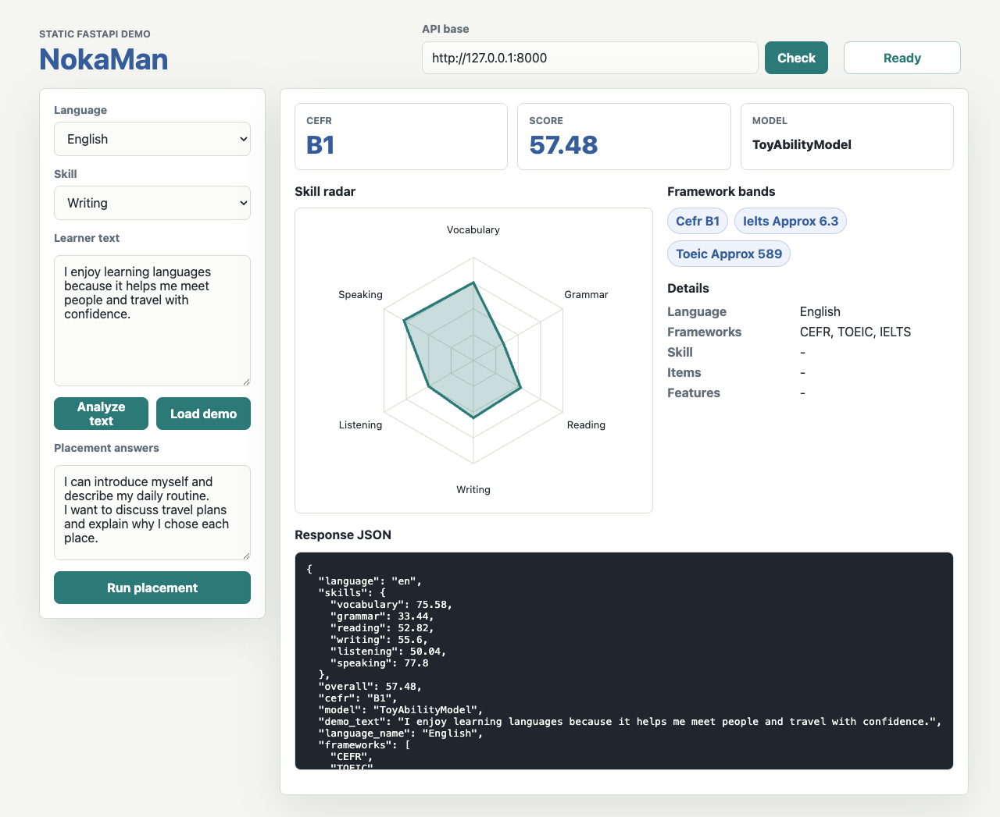

# NokaMan Static Web Demo

This no-build demo calls the local NokaMan FastAPI app and renders CEFR output,
framework bands, skill scores, and a radar chart for demo, free-text, and
placement responses.

## Run

From the repository root:

```bash
python3 -m venv .venv
source .venv/bin/activate
pip install -e ".[api]"
uvicorn nokaman.api.app:app --host 127.0.0.1 --port 8000
```

In another terminal:

```bash
cd web
python3 -m http.server 5173
```

Open `http://127.0.0.1:5173/`.

The default API base is `http://127.0.0.1:8000`. Change it in the page header if
your API is running on a different local port.

## Screenshot


